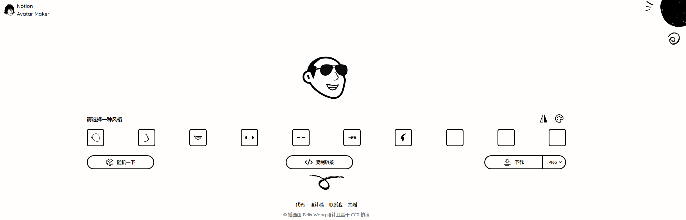
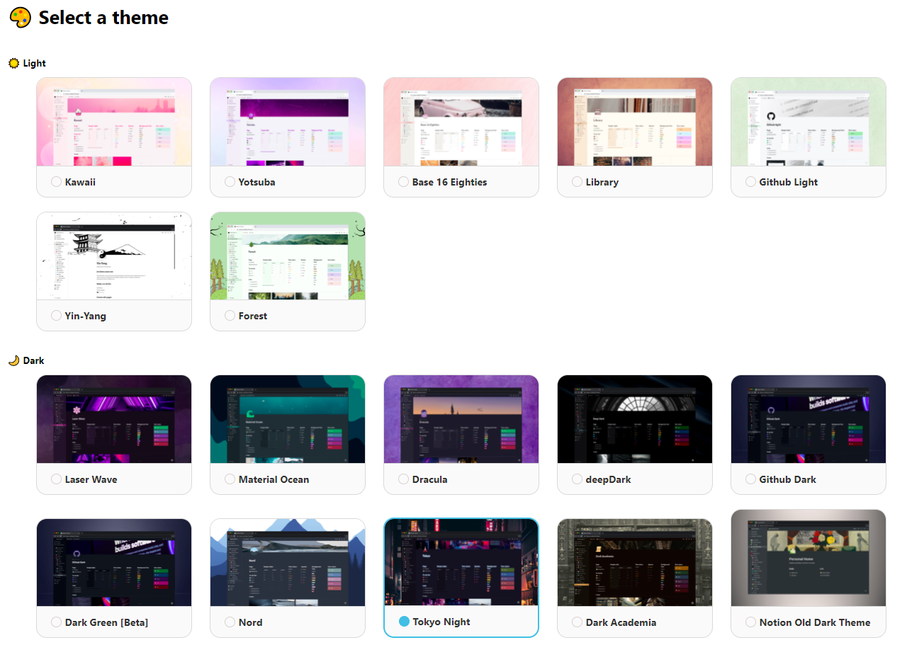

# Awesome-Notion
Utils of Notion

---

[TOC] 

+++

## Notion Beautify

|       Project       | Link | Brief Description |
| :-----------------: | :----: | :-----------: |
| [Notion-style Avatar](#Notion-style Avatar) | <https://notion-avatar.vercel.app/zh> | 一键生成notion风格头像 |
| [Notion Themes](#Notion Themes) | https://notionthemes.yudax.me | Make your Notion pretty with custom themes |

### Notion-style Avatar

### Notion Themes

Notion Themes is an **open-source **$\textcolor{GreenYellow}{web\ extension} $ to apply custom themes to Notion, Install Notion Themes and change the overall look and feel of Notion. Select from 10+ different dark/light color schemes.

**Works on Chrome/ Brave/ Firefox/ Opera/ Egde browsers.**

> It’s easy to use !
>
> 1. Choose a theme you like
> 2. Restart your notion page

## Notion Widgets

## Notion+

## Notion API

## Notion Tutorials

## Notion Templates

## 
